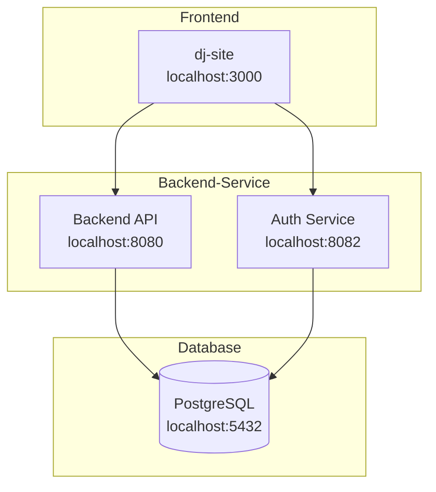

# @wxyc/shared

Shared DTOs, test utilities, and E2E tests for WXYC services.

## Full-Stack Development Setup

This repository includes a setup script to quickly bootstrap the entire WXYC development environment.

### Architecture



### Quick Start

```bash
# Clone this repository
git clone git@github.com:WXYC/wxyc-shared.git
cd wxyc-shared

# Run the setup script
./scripts/setup-dev-environment.sh
```

The script will:
1. Check for required dependencies (Docker, Node.js, npm, git)
2. Clone Backend-Service and dj-site repositories (if not present)
3. Install npm dependencies
4. Start PostgreSQL database
5. Start backend and auth services
6. Start the frontend
7. Verify all services with health checks

### Script Options

```bash
# Show help
./scripts/setup-dev-environment.sh --help

# Skip repository cloning (if already cloned)
./scripts/setup-dev-environment.sh --skip-clone

# Skip npm install (if dependencies are current)
./scripts/setup-dev-environment.sh --skip-deps

# Start only backend services
./scripts/setup-dev-environment.sh --backend-only

# Start only frontend (assumes backend is running)
./scripts/setup-dev-environment.sh --frontend-only
```

### Environment Variables

| Variable | Default | Description |
|----------|---------|-------------|
| `WXYC_DEV_ROOT` | `..` | Directory containing/for WXYC repositories |
| `BACKEND_BRANCH` | `main` | Backend-Service branch to checkout |
| `FRONTEND_BRANCH` | `main` | dj-site branch to checkout |

### Health Check Endpoints

| Service | URL | Expected Response |
|---------|-----|-------------------|
| Backend | http://localhost:8080/healthcheck | `200 OK` |
| Auth | http://localhost:8082/auth/ok | `200 OK` |
| Frontend | http://localhost:3000 | `200 OK` |

### Test Credentials

Once running, log in with any of these accounts (password: `testpassword123`):

| Username | Role |
|----------|------|
| test_member | member |
| test_dj1 | dj |
| test_dj2 | dj |
| test_music_director | musicDirector |
| test_station_manager | stationManager |

## Overview

This package serves as the single source of truth for:

- **DTOs**: TypeScript interfaces for all API request/response types
- **Validation**: Shared validation utilities for consistent validation across services
- **Test Utilities**: Shared fixtures, factories, and assertions
- **E2E Tests**: End-to-end tests that verify full-stack integration

## Installation

```bash
npm install @wxyc/shared
```

## Usage

### DTOs

```typescript
import {
  FlowsheetEntryResponse,
  AlbumSearchResult,
  isFlowsheetSongEntry,
} from '@wxyc/shared/dtos';

// Type your API responses
const entries: FlowsheetEntryResponse[] = await fetchFlowsheet();

// Use type guards
for (const entry of entries) {
  if (isFlowsheetSongEntry(entry)) {
    console.log(`${entry.artist_name} - ${entry.track_title}`);
  }
}
```

### Test Utilities

```typescript
import {
  createTestAlbum,
  createTestFlowsheetEntry,
  assertValidFlowsheetEntry,
  resetIdCounter,
} from '@wxyc/shared/test-utils';

describe('MyComponent', () => {
  beforeEach(() => {
    resetIdCounter();
  });

  it('should display album', () => {
    const album = createTestAlbum({ album_title: 'Custom Title' });
    // ...
  });
});
```

### Validation

```typescript
import {
  isValidEmail,
  validateEmail,
  EMAIL_REGEX,
} from '@wxyc/shared/validation';

// Simple boolean check
if (isValidEmail(userInput)) {
  // proceed
}

// Structured validation with error messages
const result = validateEmail(userInput);
if (!result.valid) {
  showError(result.error); // "Email is required" or "Invalid email format"
}

// Use the regex directly if needed
const isValid = EMAIL_REGEX.test(email);
```

## Available Exports

### DTOs (`@wxyc/shared/dtos`)

| Module | Description |
|--------|-------------|
| `flowsheet.dto` | Flowsheet entries, shows, on-air status |
| `catalog.dto` | Albums, artists, search results |
| `rotation.dto` | Rotation entries and frequencies |
| `schedule.dto` | DJ schedule and shifts |
| `dj.dto` | DJ profiles, bins, playlists |
| `request.dto` | Song requests, device auth |
| `metadata.dto` | External metadata (Discogs, Spotify) |
| `common.dto` | Shared types (errors, pagination, genres) |

### Test Utilities (`@wxyc/shared/test-utils`)

| Module | Description |
|--------|-------------|
| `fixtures` | Static test data for common entities |
| `factories` | Factory functions with override support |
| `assertions` | Custom assertion helpers |

### Validation (`@wxyc/shared/validation`)

| Export | Description |
|--------|-------------|
| `EMAIL_REGEX` | Regex pattern for email validation |
| `isValidEmail(email)` | Returns `true` if valid email format |
| `validateEmail(email)` | Returns `{ valid, error? }` with detailed result |
| `ValidationResult` | TypeScript type for validation results |

## Development

```bash
# Install dependencies
npm install

# Build
npm run build

# Run unit tests
npm test

# Run E2E tests (requires running services)
npm run test:e2e

# Type check
npm run lint
```

## E2E Tests

See [e2e/README.md](./e2e/README.md) for details on running E2E tests.

## Contributing

1. Add new DTOs in `src/dtos/`
2. Export them from `src/dtos/index.ts`
3. Add corresponding test fixtures/factories
4. Run `npm run lint` to verify types
