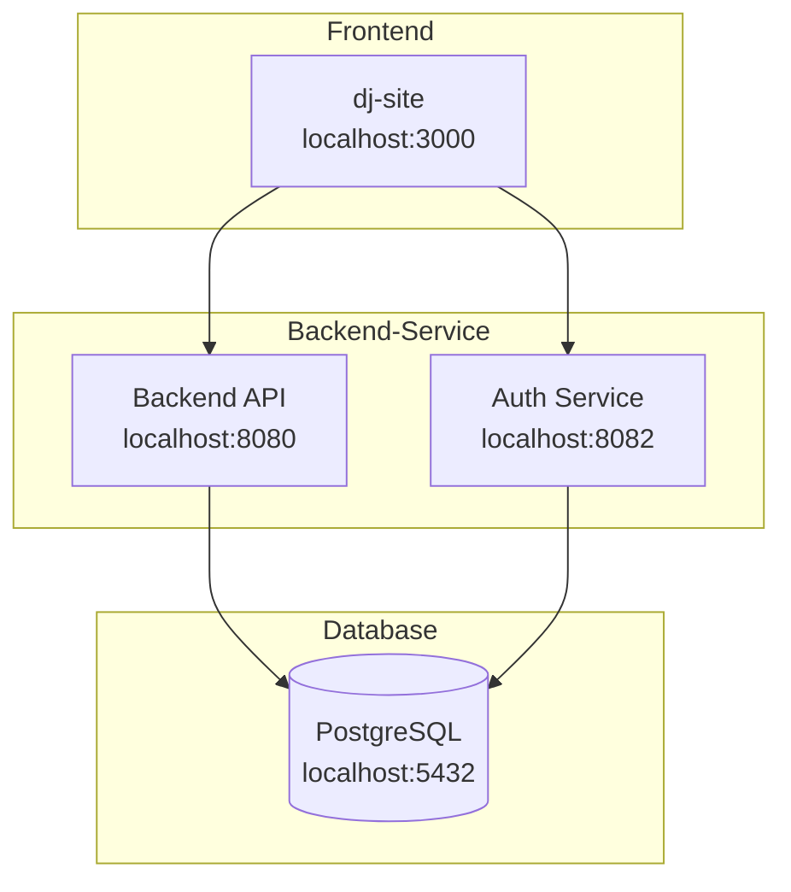

# @wxyc/shared

Shared DTOs, authentication, validation, and test utilities for WXYC services.

## Full-Stack Development Setup

This repository includes a setup script to quickly bootstrap the entire WXYC development environment.

### Architecture



### Quick Start

```bash
# Clone this repository
git clone git@github.com:WXYC/wxyc-shared.git
cd wxyc-shared

# Run the setup script
./scripts/setup-dev-environment.sh
```

The script will:
1. Check for required dependencies (Docker, Node.js, npm, git)
2. Clone Backend-Service and dj-site repositories (if not present)
3. Install npm dependencies
4. Start PostgreSQL database
5. Start backend and auth services
6. Start the frontend
7. Verify all services with health checks

### Script Options

```bash
# Show help
./scripts/setup-dev-environment.sh --help

# Skip repository cloning (if already cloned)
./scripts/setup-dev-environment.sh --skip-clone

# Skip npm install (if dependencies are current)
./scripts/setup-dev-environment.sh --skip-deps

# Start only backend services
./scripts/setup-dev-environment.sh --backend-only

# Start only frontend (assumes backend is running)
./scripts/setup-dev-environment.sh --frontend-only
```

### Environment Variables

| Variable | Default | Description |
|----------|---------|-------------|
| `WXYC_DEV_ROOT` | `..` | Directory containing/for WXYC repositories |
| `BACKEND_BRANCH` | `main` | Backend-Service branch to checkout |
| `FRONTEND_BRANCH` | `main` | dj-site branch to checkout |

### Health Check Endpoints

| Service | URL | Expected Response |
|---------|-----|-------------------|
| Backend | http://localhost:8080/healthcheck | `200 OK` |
| Auth | http://localhost:8082/auth/ok | `200 OK` |
| Frontend | http://localhost:3000 | `200 OK` |

### Test Credentials

Once running, log in with any of these accounts (password: `testpassword123`):

| Username | Role |
|----------|------|
| test_member | member |
| test_dj1 | dj |
| test_dj2 | dj |
| test_music_director | musicDirector |
| test_station_manager | stationManager |

## Overview

This package serves as the single source of truth for:

- **DTOs**: TypeScript interfaces for all API request/response types (generated from OpenAPI)
- **Auth Client**: Better Auth client with role hierarchy, capabilities, and branded authorization types
- **Validation**: Shared validation utilities for consistent validation across services
- **Test Utilities**: Shared fixtures, factories, and assertions
- **E2E Tests**: End-to-end tests that verify full-stack integration

## Installation

This package is published to GitHub Packages (not public npm).

### 1. Configure npm to use GitHub Packages for @wxyc scope

Create or update `.npmrc` in your project root:

```
@wxyc:registry=https://npm.pkg.github.com
```

### 2. Authenticate with GitHub Packages

You need a GitHub Personal Access Token with `read:packages` scope.

**For local development**, authenticate once:

```bash
npm login --registry=https://npm.pkg.github.com --scope=@wxyc
# Username: your-github-username
# Password: your-personal-access-token
# Email: your-email
```

**For CI (GitHub Actions)**, add to your workflow:

```yaml
- uses: actions/setup-node@v4
  with:
    node-version: '22'
    registry-url: 'https://npm.pkg.github.com'
    scope: '@wxyc'

- run: npm ci
  env:
    NODE_AUTH_TOKEN: ${{ secrets.GITHUB_TOKEN }}
```

### 3. Install the package

```bash
npm install @wxyc/shared
```

## Usage

### DTOs

```typescript
import {
  FlowsheetEntryResponse,
  AlbumSearchResult,
  isFlowsheetSongEntry,
} from '@wxyc/shared/dtos';

// Type your API responses
const entries: FlowsheetEntryResponse[] = await fetchFlowsheet();

// Use type guards
for (const entry of entries) {
  if (isFlowsheetSongEntry(entry)) {
    console.log(`${entry.artist_name} - ${entry.track_title}`);
  }
}
```

### Test Utilities

```typescript
import {
  createTestAlbum,
  createTestFlowsheetEntry,
  assertValidFlowsheetEntry,
  resetIdCounter,
} from '@wxyc/shared/test-utils';

describe('MyComponent', () => {
  beforeEach(() => {
    resetIdCounter();
  });

  it('should display album', () => {
    const album = createTestAlbum({ album_title: 'Custom Title' });
    // ...
  });
});
```

### Validation

```typescript
import {
  isValidEmail,
  validateEmail,
  EMAIL_REGEX,
} from '@wxyc/shared/validation';

// Simple boolean check
if (isValidEmail(userInput)) {
  // proceed
}

// Structured validation with error messages
const result = validateEmail(userInput);
if (!result.valid) {
  showError(result.error); // "Email is required" or "Invalid email format"
}

// Use the regex directly if needed
const isValid = EMAIL_REGEX.test(email);
```

### Auth Client

```typescript
import {
  // Pre-configured Better Auth client
  authClient,
  createWXYCAuthClient,
  getJWTToken,

  // Role checking
  Authorization,
  roleToAuthorization,
  checkRole,

  // Capability checking
  checkCapability,
  hasCapability,

  // Permission system
  hasPermission,
  canManageRoster,
} from '@wxyc/shared/auth-client';

// Check authorization level
const auth = roleToAuthorization(user.role); // "stationManager" -> Authorization.SM
if (auth >= Authorization.DJ) {
  // User is at least a DJ
}

// Compile-time enforced authorization checks
const result = checkRole(user, Authorization.SM);
if (!result.authorized) {
  return <AccessDenied reason={result.reason} />;
}
// result.user is now branded as RoleAuthorizedUser<Authorization.SM>

// Check capabilities (cross-cutting permissions)
const editorCheck = checkCapability(user, "editor");
if (editorCheck.authorized) {
  // User can edit website content
}

// Resource-based permissions
if (hasPermission(user.role, "catalog", "write")) {
  // User can modify the music catalog
}
```

## Available Exports

### DTOs (`@wxyc/shared/dtos`)

| Module | Description |
|--------|-------------|
| `flowsheet.dto` | Flowsheet entries, shows, on-air status |
| `catalog.dto` | Albums, artists, search results |
| `rotation.dto` | Rotation entries and frequencies |
| `schedule.dto` | DJ schedule and shifts |
| `dj.dto` | DJ profiles, bins, playlists |
| `request.dto` | Song requests, device auth |
| `metadata.dto` | External metadata (Discogs, Spotify) |
| `common.dto` | Shared types (errors, pagination, genres) |

### Test Utilities (`@wxyc/shared/test-utils`)

| Module | Description |
|--------|-------------|
| `fixtures` | Static test data for common entities |
| `factories` | Factory functions with override support |
| `assertions` | Custom assertion helpers |

### Validation (`@wxyc/shared/validation`)

| Export | Description |
|--------|-------------|
| `EMAIL_REGEX` | Regex pattern for email validation |
| `isValidEmail(email)` | Returns `true` if valid email format |
| `validateEmail(email)` | Returns `{ valid, error? }` with detailed result |
| `ValidationResult` | TypeScript type for validation results |

### Auth Client (`@wxyc/shared/auth-client`)

| Export | Description |
|--------|-------------|
| `authClient` | Pre-configured Better Auth client |
| `createWXYCAuthClient(baseURL)` | Factory to create auth client |
| `getJWTToken()` | Get JWT token for API calls |
| **Authorization** | |
| `Authorization` | Enum: `NO`, `DJ`, `MD`, `SM`, `ADMIN` |
| `roleToAuthorization(role)` | Convert role string to Authorization |
| `authorizationToRole(auth)` | Convert Authorization to role string |
| `checkRole(user, level)` | Check role, returns branded user type |
| `checkCapability(user, cap)` | Check capability, returns branded user type |
| **Roles & Permissions** | |
| `ROLES` | All WXYC roles ordered by privilege |
| `WXYCRole` | Type for role strings |
| `hasPermission(role, resource, action)` | Check resource permission |
| `canManageRoster(role)` | Check roster management access |
| `canAssignRoles(role)` | Check if can assign roles to others |
| `getAssignableRoles(role)` | Get roles this role can assign |
| **Capabilities** | |
| `CAPABILITIES` | Cross-cutting capabilities: `editor`, `webmaster` |
| `Capability` | Type for capability strings |
| `hasCapability(caps, cap)` | Check if user has capability |
| `canAssignCapability(user, cap)` | Check if user can assign capability |

## Development

```bash
# Install dependencies
npm install

# Build
npm run build

# Run unit tests
npm test

# Run E2E tests (requires running services)
npm run test:e2e

# Type check
npm run lint
```

## E2E Tests

See [e2e/README.md](./e2e/README.md) for details on running E2E tests.

## Contributing

1. Add new DTOs in `src/dtos/`
2. Export them from `src/dtos/index.ts`
3. Add corresponding test fixtures/factories
4. Run `npm run lint` to verify types
