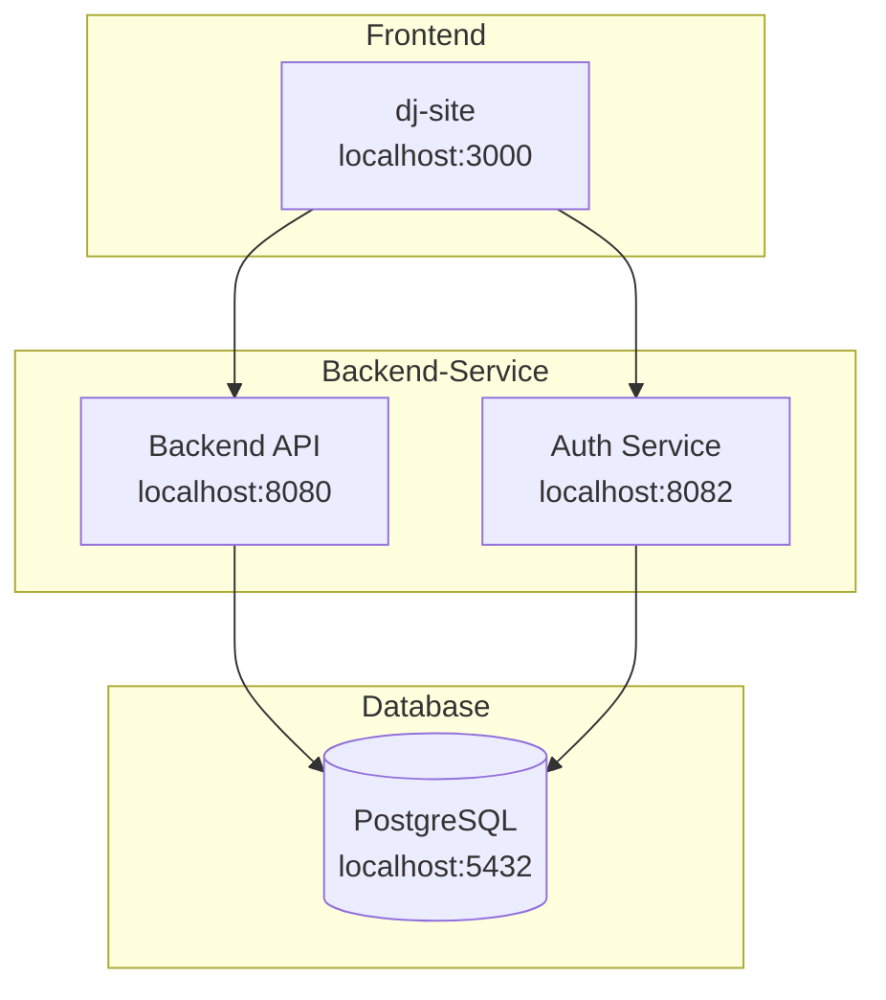

# @wxyc/shared

Shared DTOs, authentication, validation, and test utilities for WXYC services.

## Full-Stack Development Setup

This repository includes a setup script to quickly bootstrap the entire WXYC development environment.

### Architecture


```mermaid
flowchart TB
    subgraph Frontend
        DJ[dj-site<br/>localhost:3000]
    end

    subgraph Backend-Service
        API[Backend API<br/>localhost:8080]
        Auth[Auth Service<br/>localhost:8082]
    end

    subgraph Database
        PG[(PostgreSQL<br/>localhost:5432)]
    end

    DJ --> API
    DJ --> Auth
    API --> PG
    Auth --> PG
```

### Quick Start

```bash
# Clone this repository
git clone git@github.com:WXYC/wxyc-shared.git
cd wxyc-shared

# Run the setup script
./scripts/setup-dev-environment.sh
```

The script will:
1. Check for required dependencies (Docker, Node.js, npm, git)
2. Clone Backend-Service and dj-site repositories (if not present)
3. Install npm dependencies
4. Start PostgreSQL database
5. Start backend and auth services
6. Start the frontend
7. Verify all services with health checks

### Script Options

```bash
# Show help
./scripts/setup-dev-environment.sh --help

# Skip repository cloning (if already cloned)
./scripts/setup-dev-environment.sh --skip-clone

# Skip npm install (if dependencies are current)
./scripts/setup-dev-environment.sh --skip-deps

# Start only backend services
./scripts/setup-dev-environment.sh --backend-only

# Start only frontend (assumes backend is running)
./scripts/setup-dev-environment.sh --frontend-only
```

### Environment Variables

| Variable | Default | Description |
|----------|---------|-------------|
| `WXYC_DEV_ROOT` | `..` | Directory containing/for WXYC repositories |
| `BACKEND_BRANCH` | `main` | Backend-Service branch to checkout |
| `FRONTEND_BRANCH` | `main` | dj-site branch to checkout |

### Health Check Endpoints

| Service | URL | Expected Response |
|---------|-----|-------------------|
| Backend | http://localhost:8080/healthcheck | `200 OK` |
| Auth | http://localhost:8082/auth/ok | `200 OK` |
| Frontend | http://localhost:3000 | `200 OK` |

### Test Credentials

Once running, log in with any of these accounts (password: `testpassword123`):

| Username | Role |
|----------|------|
| test_member | member |
| test_dj1 | dj |
| test_dj2 | dj |
| test_music_director | musicDirector |
| test_station_manager | stationManager |

## Overview

This package serves as the single source of truth for:

- **DTOs**: TypeScript interfaces for all API request/response types (generated from OpenAPI)
- **Auth Client**: Better Auth client with role hierarchy, capabilities, and branded authorization types
- **Validation**: Shared validation utilities for consistent validation across services
- **Test Utilities**: Shared fixtures, factories, and assertions
- **E2E Tests**: End-to-end tests that verify full-stack integration

## Installation

This package is published to GitHub Packages (not public npm).

### 1. Configure npm to use GitHub Packages for @wxyc scope

Create or update `.npmrc` in your project root:

```
@wxyc:registry=https://npm.pkg.github.com
```

### 2. Authenticate with GitHub Packages

You need a GitHub Personal Access Token with `read:packages` scope.

**For local development**, authenticate once:

```bash
npm login --registry=https://npm.pkg.github.com --scope=@wxyc
# Username: your-github-username
# Password: your-personal-access-token
# Email: your-email
```

**For CI (GitHub Actions)**, add to your workflow:

```yaml
- uses: actions/setup-node@v4
  with:
    node-version: '22'
    registry-url: 'https://npm.pkg.github.com'
    scope: '@wxyc'

- run: npm ci
  env:
    NODE_AUTH_TOKEN: ${{ secrets.GITHUB_TOKEN }}
```

### 3. Install the package

```bash
npm install @wxyc/shared
```

## Usage

### DTOs

```typescript
import {
  FlowsheetEntryResponse,
  AlbumSearchResult,
  isFlowsheetSongEntry,
} from '@wxyc/shared/dtos';

// Type your API responses
const entries: FlowsheetEntryResponse[] = await fetchFlowsheet();

// Use type guards
for (const entry of entries) {
  if (isFlowsheetSongEntry(entry)) {
    console.log(`${entry.artist_name} - ${entry.track_title}`);
  }
}
```

### Test Utilities

```typescript
import {
  createTestAlbum,
  createTestFlowsheetEntry,
  assertValidFlowsheetEntry,
  resetIdCounter,
} from '@wxyc/shared/test-utils';

describe('MyComponent', () => {
  beforeEach(() => {
    resetIdCounter();
  });

  it('should display album', () => {
    const album = createTestAlbum({ album_title: 'Custom Title' });
    // ...
  });
});
```

### Validation

```typescript
import {
  isValidEmail,
  validateEmail,
  EMAIL_REGEX,
} from '@wxyc/shared/validation';

// Simple boolean check
if (isValidEmail(userInput)) {
  // proceed
}

// Structured validation with error messages
const result = validateEmail(userInput);
if (!result.valid) {
  showError(result.error); // "Email is required" or "Invalid email format"
}

// Use the regex directly if needed
const isValid = EMAIL_REGEX.test(email);
```

### Auth Client

```typescript
import {
  // Pre-configured Better Auth client
  authClient,
  createWXYCAuthClient,
  getJWTToken,

  // Role checking
  Authorization,
  roleToAuthorization,
  checkRole,

  // Capability checking
  checkCapability,
  hasCapability,

  // Permission system
  hasPermission,
  canManageRoster,
} from '@wxyc/shared/auth-client';

// Check authorization level
const auth = roleToAuthorization(user.role); // "stationManager" -> Authorization.SM
if (auth >= Authorization.DJ) {
  // User is at least a DJ
}

// Compile-time enforced authorization checks
const result = checkRole(user, Authorization.SM);
if (!result.authorized) {
  return <AccessDenied reason={result.reason} />;
}
// result.user is now branded as RoleAuthorizedUser<Authorization.SM>

// Check capabilities (cross-cutting permissions)
const editorCheck = checkCapability(user, "editor");
if (editorCheck.authorized) {
  // User can edit website content
}

// Resource-based permissions
if (hasPermission(user.role, "catalog", "write")) {
  // User can modify the music catalog
}
```

## Available Exports

### DTOs (`@wxyc/shared/dtos`)

| Module | Description |
|--------|-------------|
| `flowsheet.dto` | V1 flowsheet entries, shows, on-air status |
| `flowsheet-v2.dto` | V2 flowsheet entries (discriminated union by `entry_type`) |
| `catalog.dto` | Albums, artists, search results |
| `rotation.dto` | Rotation entries and frequencies |
| `schedule.dto` | DJ schedule and shifts |
| `dj.dto` | DJ profiles, bins, playlists |
| `request.dto` | Song requests, device auth |
| `metadata.dto` | External metadata (Discogs, Spotify) |
| `common.dto` | Shared types (errors, pagination, genres) |

### Auto-DJ (`@wxyc/shared/auto-dj`)

Type contracts for the auto-DJ system — the orchestrator <-> Arduino management-channel messages (`AutoDJHeartbeat`, `AutoDJCommand`, `AutoDJAck`, `AutoDJNowPlaying`, `AutoDJErrorReport`, `AutoDJButtonToggle`) and the dj-site <-> orchestrator virtual switch API (`AutoDJStatus`, `AutoDJDeactivateResponse`, ...). Adds a hand-written `AutoDJWebSocketMessage` discriminated union and type guards (`isHeartbeat`, `isCommand`, ...) over the generated schemas; string enums (`AutoDJCommandAction`, ...) are exported as runtime values.

```ts
import { isHeartbeat, AutoDJCommandAction, type AutoDJStatus } from '@wxyc/shared/auto-dj';
```

### Test Utilities (`@wxyc/shared/test-utils`)

| Module | Description |
|--------|-------------|
| `fixtures` | Static test data for common entities |
| `factories` | Factory functions with override support |
| `assertions` | Custom assertion helpers |

### Validation (`@wxyc/shared/validation`)

| Export | Description |
|--------|-------------|
| `EMAIL_REGEX` | Regex pattern for email validation |
| `isValidEmail(email)` | Returns `true` if valid email format |
| `validateEmail(email)` | Returns `{ valid, error? }` with detailed result |
| `ValidationResult` | TypeScript type for validation results |

### Auth Client (`@wxyc/shared/auth-client`)

| Export | Description |
|--------|-------------|
| `authClient` | Pre-configured Better Auth client |
| `createWXYCAuthClient(baseURL)` | Factory to create auth client |
| `getJWTToken()` | Get JWT token for API calls |
| **Authorization** | |
| `Authorization` | Enum: `NO`, `DJ`, `MD`, `SM`, `ADMIN` |
| `roleToAuthorization(role)` | Convert role string to Authorization |
| `authorizationToRole(auth)` | Convert Authorization to role string |
| `checkRole(user, level)` | Check role, returns branded user type |
| `checkCapability(user, cap)` | Check capability, returns branded user type |
| **Roles & Permissions** | |
| `ROLES` | All WXYC roles ordered by privilege |
| `WXYCRole` | Type for role strings |
| `hasPermission(role, resource, action)` | Check resource permission |
| `canManageRoster(role)` | Check roster management access |
| `canAssignRoles(role)` | Check if can assign roles to others |
| `getAssignableRoles(role)` | Get roles this role can assign |
| **Capabilities** | |
| `CAPABILITIES` | Cross-cutting capabilities: `editor`, `webmaster` |
| `Capability` | Type for capability strings |
| `hasCapability(caps, cap)` | Check if user has capability |
| `canAssignCapability(user, cap)` | Check if user can assign capability |

## Charset Torture Corpus

`src/test-utils/charset-torture.json` is the canonical UTF-8 torture-corpus shared by every WXYC repo's CI. Each entry is one realistic encoding hazard (Greek sigma forms, CJK, emoji, NFC/NFD pairs, Latin-1-as-UTF-8 mojibake, embedded NUL bytes, etc.). The contract every consuming repo must satisfy:

> Load the corpus, write each `entry.input` through your primary storage path, read it back, and assert byte equality.

If any byte gets dropped, mis-decoded, or silently re-normalized anywhere in any pipeline, that repo's CI fails on the next push.

### Schema

```ts
interface CharsetTortureEntry {
  input: string;              // raw UTF-8 the storage layer must round-trip
  expected_storage: string;   // canonical (mojibake-fixed) form
  expected_match_form: string | null;  // to_match_form output (WX-2 acceptance)
  expected_ascii_form: string | null;  // to_ascii_form output (WX-2 acceptance)
  notes: string;              // why this entry exists
}
```

The corpus is keyed by category — `greek`, `cyrillic`, `cjk`, `arabic`, `hebrew`, `emoji`, `latin_extended`, `bidi_marks`, `zwj`, `normalization`, `mojibake_known`, `quoting`. See `src/test-utils/charset-torture.ts` for the full type and the flattened `charsetTortureEntries` iterator.

### Detector authoring rule

A WX-1 detector iterates the corpus, writes each `entry.input` through the storage path under test, reads it back, and asserts byte-equality. The rule for what the detector is allowed to skip is narrow: **filter only what breaks the test's transport, never what tests the detector's job.**

Some entries genuinely can't pass through some transports — a literal U+0009 tab inside a TSV builder breaks the TSV format itself, not the detector. For those cases it's correct to filter the input out of that test and record the case as an EXPECTED_FAILURE with a stable tag like `[<repo>:tsv-tab-byte]`. The tag pins the skip to a known transport limitation rather than a charset bug.

It is **not** correct to filter inputs that are precisely what the detector exists to surface. A PG TEXT write-boundary detector must not pre-filter NUL-containing inputs: those are the cases the boundary needs to handle. If the import path mishandles them, the detector is supposed to fail — tag the xfail with the same `[<repo>:pg-null-byte]` shape and let the failure stand until the boundary is fixed. Once the fix lands, the assertion compares the read-back to whatever the policy says the stored form should be (e.g. `input.replace('\0', '')` for strip-at-boundary), and the xfail entry retires in the same commit. If you find yourself writing `if input.contains('\0') { continue; }` before the storage call, the detector has stopped testing its boundary.

### TypeScript consumers

```ts
import { charsetTortureEntries, charsetTortureCorpus } from '@wxyc/shared/test-utils';

it.each(charsetTortureEntries)(
  '$category: $input round-trips through storage',
  async ({ input }) => {
    const id = await db.write({ name: input });
    const row = await db.read(id);
    expect(row.name).toBe(input);
  },
);
```

### Non-TypeScript consumers (Python, Rust, Java)

Every non-TS consumer extracts `charset-torture.json` from the published `@wxyc/shared` tarball and pins its SHA-256 in-repo. The path inside the tarball is stable: `package/src/test-utils/charset-torture.json`.

**Drift defense is content-hash equality, not semver matching.** Each consumer pins the expected SHA-256 in `tests/fixtures/charset-torture.json.sha256`. The M3 drift-guard workflow fails CI if the extracted JSON's hash differs from the pin, prompting an explicit corpus-bump PR. To intentionally bump: edit the JSON in this repo, update `PINNED_SHA256` in `tests/charset-torture.test.ts`, then ship a coordinated PR to every consumer's pin file.

#### Python recipe

```bash
# In CI, before running pytest:
npm pack @wxyc/shared@<pinned-version> --silent
tar -xzf wxyc-shared-*.tgz package/src/test-utils/charset-torture.json
mv package/src/test-utils/charset-torture.json tests/fixtures/charset-torture.json
sha256sum -c tests/fixtures/charset-torture.json.sha256
```

```python
# tests/charset_torture.py
import json
from pathlib import Path

_CORPUS_PATH = Path(__file__).parent / 'fixtures' / 'charset-torture.json'

def load_corpus() -> dict:
    return json.loads(_CORPUS_PATH.read_text(encoding='utf-8'))

def iter_entries():
    corpus = load_corpus()
    for category, entries in corpus['categories'].items():
        for entry in entries:
            yield {**entry, 'category': category}
```

```python
# tests/test_charset_torture.py
import pytest
from .charset_torture import iter_entries

@pytest.mark.parametrize('entry', list(iter_entries()), ids=lambda e: f"{e['category']}:{e['input'][:20]}")
def test_roundtrip(entry, db):
    row_id = db.write(name=entry['input'])
    row = db.read(row_id)
    assert row.name == entry['input'], f"{entry['category']}: {entry['notes']}"
```

#### Rust recipe

Vendor the JSON at the crate root via a Makefile target that re-runs the npm-pack extract:

```makefile
# Makefile
fixtures/charset-torture.json:
	npm pack @wxyc/shared@$(WXYC_SHARED_VERSION) --silent
	tar -xzf wxyc-shared-*.tgz package/src/test-utils/charset-torture.json
	mv package/src/test-utils/charset-torture.json $@
	rm -f wxyc-shared-*.tgz
	sha256sum -c fixtures/charset-torture.json.sha256
```

```rust
// tests/charset_torture.rs
use serde_json::Value;

const CORPUS: &str = include_str!("../fixtures/charset-torture.json");

fn load() -> Value {
    serde_json::from_str(CORPUS).expect("charset-torture.json is valid")
}

#[test]
fn roundtrip_through_storage() {
    let corpus = load();
    for (category, entries) in corpus["categories"].as_object().unwrap() {
        for entry in entries.as_array().unwrap() {
            let input = entry["input"].as_str().unwrap();
            let written = my_storage::write(input).unwrap();
            let read_back = my_storage::read(written).unwrap();
            assert_eq!(read_back, input, "{}: {}", category, entry["notes"]);
        }
    }
}
```

#### Java recipe

```xml
<!-- pom.xml: copy the JSON from a CI artifact into src/test/resources/ -->
<plugin>
  <artifactId>maven-resources-plugin</artifactId>
  <executions>
    <execution>
      <id>copy-charset-torture</id>
      <phase>process-test-resources</phase>
      <goals><goal>copy-resources</goal></goals>
      <configuration>
        <outputDirectory>${project.build.testOutputDirectory}/fixtures</outputDirectory>
        <resources><resource>
          <directory>${charset.torture.tarball.dir}/package/src/test-utils</directory>
          <includes><include>charset-torture.json</include></includes>
        </resource></resources>
      </configuration>
    </execution>
  </executions>
</plugin>
```

```java
// src/test/java/.../CharsetTortureTest.java
import com.fasterxml.jackson.databind.JsonNode;
import com.fasterxml.jackson.databind.ObjectMapper;

JsonNode corpus = new ObjectMapper()
    .readTree(getClass().getResourceAsStream("/fixtures/charset-torture.json"));
corpus.get("categories").fields().forEachRemaining(category -> {
    category.getValue().forEach(entry -> {
        String input = entry.get("input").asText();
        String roundTripped = storage.writeAndRead(input);
        assertEquals(input, roundTripped, category.getKey() + ": " + entry.get("notes").asText());
    });
});
```

#### CI fallback (no npm available)

Where a repo's CI image lacks `npm`, fetch the JSON from a tagged GitHub Release of `wxyc-shared` instead:

```bash
curl -fsSL https://github.com/WXYC/wxyc-shared/releases/download/v<VERSION>/charset-torture.json \
  -o tests/fixtures/charset-torture.json
sha256sum -c tests/fixtures/charset-torture.json.sha256
```

This is the documented fallback only — the npm-pack recipe is the v1 happy path.

#### Drift guard CI

Every consuming repo should add a one-job CI workflow that calls the reusable drift-guard at `WXYC/wxyc-shared/.github/workflows/check-charset-corpus-drift.yml`. The job extracts `charset-torture.json` from the published `@wxyc/shared` tarball, hashes it, and compares against the consumer's pinned SHA-256 — failing CI loudly if the upstream corpus has moved.

```yaml
# .github/workflows/charset-corpus-drift.yml in the consuming repo
name: Charset Corpus Drift

on:
  pull_request:
  push:
    branches: [main]
  schedule:
    - cron: "17 8 * * 1"  # Monday morning catches upstream bumps merged over the weekend

jobs:
  drift:
    uses: WXYC/wxyc-shared/.github/workflows/check-charset-corpus-drift.yml@main
    with:
      pinned-sha256: 41a18c5c0a92d129ec4b575827b6874196bfb7591e4bdf237a918a5da2de7b66
      # package-version: 'latest'  # optional; pin to a specific @wxyc/shared release if needed
    secrets:
      npm-token: ${{ secrets.GITHUB_TOKEN }}  # needs read:packages on the WXYC org
```

When the guard fails, the consumer's response is one of:

1. **Bump the pin.** Read the diff in `WXYC/wxyc-shared`, copy the new SHA into `tests/fixtures/charset-torture.json.sha256`, re-run the local round-trip suite to confirm the new fixture still passes, and open a PR.
2. **Freeze the pin for one release.** Add a comment in `tests/fixtures/charset-torture.json.sha256`:
   ```
   # corpus-pin-frozen reason: <why this consumer can't bump yet>
   ```
   The freeze is enforced by reviewers, not the workflow — keep the reason specific and link the follow-up issue.

### Adding a category or entry

1. Edit `src/test-utils/charset-torture.json`.
2. Run `shasum -a 256 src/test-utils/charset-torture.json` and paste the new hash into `PINNED_SHA256` in `tests/charset-torture.test.ts`.
3. `npm test` — confirm the byte-stability test passes.
4. Open a single PR that bumps the pin in **every** consuming repo's `tests/fixtures/charset-torture.json.sha256`. Without the coordinated bump, downstream CI fails until each consumer's pin is updated.

## Development

```bash
# Install dependencies
npm install

# Build
npm run build

# Run unit tests
npm test

# Run E2E tests (requires running services)
npm run test:e2e

# Type check
npm run lint

# Generate TypeScript types from api.yaml
npm run generate:typescript
```

### Code Generation

TypeScript types are generated from `api.yaml` using [`openapi-typescript`](https://openapi-ts.dev/) (pure Node.js, no JVM required):

```bash
npm run generate:typescript  # TypeScript types (openapi-typescript)
npm run generate:swift       # iOS types (openapi-generator-cli, requires Java)
npm run generate:kotlin      # Android types (openapi-generator-cli, requires Java)
npm run generate:python      # Python models (datamodel-codegen)
```

## E2E Tests

See [e2e/README.md](./e2e/README.md) for details on running E2E tests.

## Staging gate (bs-lml-gate)

`.github/workflows/bs-lml-gate.yml` coordinates Backend-Service + library-metadata-lookup prod promotion. The shape: a PR merges to `main` in either repo → that repo's staging deploy fires → on healthy, the deploy job sends a `repository_dispatch` here → this workflow re-resolves the *current* `main` SHA of both repos, polls both staging `/health` endpoints, verifies each staging build's `/version` matches its `main` SHA, runs the wxyc-shared E2E suite + `wxyc-canary check --suite=smoke` against staging, and on all-pass fast-forwards each repo's `prod` branch to its `main` SHA. The existing prod auto-deploys in each repo then fire on `push: prod`.

The gate is intentionally coupled — BS and LML promote together, and a broken BS staging holds LML hotfixes hostage. That's the trade-off for catching schema drift between the two pre-prod. There's a documented bypass path (see below).

### Trigger

```
repository_dispatch:
  types: [bs-staging-deployed, lml-staging-deployed]
```

`client_payload.source_sha` is informational only. The gate always re-queries `main` via the GitHub API after acquiring the concurrency lock, so a stale dispatch arriving after a newer merge cannot regress `prod`.

### Concurrency

`group: bs-lml-gate`, `cancel-in-progress: false`. A new dispatch queues behind a running gate; cancellation mid-push could leave one repo's `prod` advanced and the other not. Each dequeue uses whatever `main` SHA is current at that moment — we always promote the latest green pair.

### Bypass

`workflow_dispatch` with `skip_gate: true` and a non-empty `justification`. The bypass path still resolves both `main` SHAs and is still a no-op if `prod == main` already; it only skips the health/version/E2E/canary checks. A comment is appended to the pinned tracker issue (`vars.GATE_BYPASS_ISSUE_NUMBER`) *before* any prod push — if the audit append fails, the workflow exits non-zero before touching prod. There are no silent bypasses.

### Setup checklist

This workflow assumes the following one-time setup is done in the wxyc-shared repo:

1. **Fine-grained PATs**: `PROD_PUSH_TOKEN_BS` and `PROD_PUSH_TOKEN_LML`, each scoped to `Contents: write` on the `prod` branch of *only* their respective repo. Store as repo secrets.
2. **Staging URLs** as repo *variables* (not secrets — staging hostnames aren't sensitive): `BS_STAGING_BASE_URL`, `BS_STAGING_AUTH_URL`, `LML_STAGING_BASE_URL`.
3. **Bypass tracker issue**: a pinned issue in this repo. Set `vars.GATE_BYPASS_ISSUE_NUMBER` to its number.
4. **Staging API key**: `LML_API_KEY_STAGING` (added by phase 3).
5. **E2E credentials**: already present (`E2E_TEST_DJ_EMAIL`, `E2E_TEST_DJ_PASSWORD`).

Once the dispatchers in BS (phase 4) and LML (phase 3) are live, the gate fires automatically.

### Helpers

The workflow keeps logic in shell helpers at `scripts/bs-lml-gate/` (not the top-level `scripts/` dir, so the gate's blast radius is one directory listing). Each helper takes input via env vars, writes outputs to `$GITHUB_OUTPUT`, and has bats tests at `scripts/__tests__/bs-lml-gate/`:

- `resolve-shas.sh` — fetches both repos' main + prod SHAs via `gh api`
- `poll-staging-health.sh` — polls a URL until 200 or timeout
- `verify-version.sh` — compares a service's `/version` to an expected SHA
- `push-prod.sh` — advances a repo's `prod` ref via the GitHub refs API
- `log-bypass.sh` — appends an audit comment to the tracker issue

Run helper tests with `npm run test:bs-lml-gate`.

## Railway Deployment

See [`railway/`](./railway/) for the Railway service topology, environment variable reference, and setup instructions for replicating the deployment environment.

## Contributing

1. Define new schemas in `api.yaml` (the OpenAPI spec is the single source of truth for all DTOs)
2. Run `npm run generate:typescript` to regenerate TypeScript types
3. Export them from `src/dtos/index.ts`
4. Add corresponding test fixtures/factories
5. Run `npm run lint` to verify types
6. If Python services consume the new types, run `npm run generate:python` to update the generated Python models
