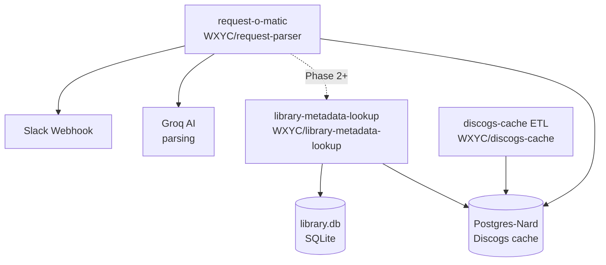

# Railway Deployment

Configuration and documentation for the WXYC Railway deployment.

## Service Topology



## Services

### request-o-matic

Parses song request messages via Groq AI, searches the library, fetches artwork from Discogs, and posts results to Slack.

| Setting | Value |
|---------|-------|
| Repo | [WXYC/request-parser](https://github.com/WXYC/request-parser) |
| Staging branch | `main` |
| Production branch | `prod` |
| Builder | nixpacks |
| Health check | `GET /health` |

### library-metadata-lookup

Searches the library catalog and cross-references with Discogs metadata. Extracted from request-o-matic to separate search/lookup from message parsing.

| Setting | Value |
|---------|-------|
| Repo | [WXYC/library-metadata-lookup](https://github.com/WXYC/library-metadata-lookup) |
| Staging branch | `main` |
| Production branch | `prod` |
| Builder | Dockerfile |
| Health check | `GET /health` |

### Postgres-Nard

PostgreSQL database used as a Discogs metadata cache. Populated by the [discogs-cache](https://github.com/WXYC/discogs-cache) ETL pipeline.

Shared by both request-o-matic and library-metadata-lookup via the `DATABASE_URL_DISCOGS` environment variable.

Internal URL: `postgres-nard.railway.internal:5432/railway`

## Environment Variables

### Shared across services

These variables use the same values on both request-o-matic and library-metadata-lookup:

| Variable | Description | Required |
|----------|-------------|----------|
| `DISCOGS_TOKEN` | Discogs API token | No (degrades gracefully) |
| `DATABASE_URL_DISCOGS` | PostgreSQL URL for Discogs cache | No (degrades to API-only) |
| `SENTRY_DSN` | Sentry error tracking | No |
| `POSTHOG_API_KEY` | PostHog telemetry | No |

### request-o-matic only

| Variable | Description | Required |
|----------|-------------|----------|
| `GROQ_API_KEY` | Groq AI key for message parsing | Yes |
| `SLACK_WEBHOOK_URL` | Slack webhook for posting results | No |
| `LOOKUP_SERVICE_URL` | URL of library-metadata-lookup (Phase 2+) | No |

### library-metadata-lookup only

| Variable | Description | Default |
|----------|-------------|---------|
| `LIBRARY_DB_PATH` | Path to SQLite database | `library.db` |
| `DISCOGS_TRACK_CACHE_TTL` | In-memory track cache TTL (seconds) | 3600 |
| `DISCOGS_RELEASE_CACHE_TTL` | In-memory release cache TTL (seconds) | 14400 |
| `DISCOGS_SEARCH_CACHE_TTL` | In-memory search cache TTL (seconds) | 3600 |
| `DISCOGS_CACHE_MAXSIZE` | Max entries per in-memory cache | 1000 |
| `DISCOGS_RATE_LIMIT` | Max Discogs API requests/minute | 50 |
| `DISCOGS_MAX_CONCURRENT` | Max concurrent Discogs requests | 5 |
| `DISCOGS_MAX_RETRIES` | Max retries on 429 errors | 2 |

## Environments

Each service has two environments:

| Environment | Branch | Auto-deploy |
|-------------|--------|-------------|
| Staging | `main` | Yes |
| Production | `prod` | Yes |

## Internal Networking

Services on the same Railway project can communicate via internal URLs without exposing public endpoints:

```
postgres-nard.railway.internal:5432/railway
library-metadata-lookup-staging.railway.internal:8000
library-metadata-lookup-production.railway.internal:8000
```

## Setting Up a New Project

See `services.yaml` for the full topology and `setup-environment.sh` for guided setup instructions.

## Migration Phases

This infrastructure supports the phased migration from monolith to microservices:

1. **Phase 1** (current): Deploy library-metadata-lookup as standalone service
2. **Phase 2**: request-o-matic calls both local search and library-metadata-lookup, compares results
3. **Phase 3**: Switch request-o-matic to use library-metadata-lookup as primary
4. **Phase 4**: Remove search/lookup code from request-o-matic
